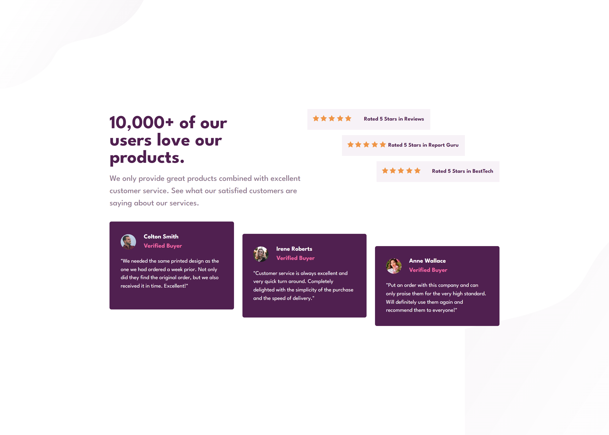
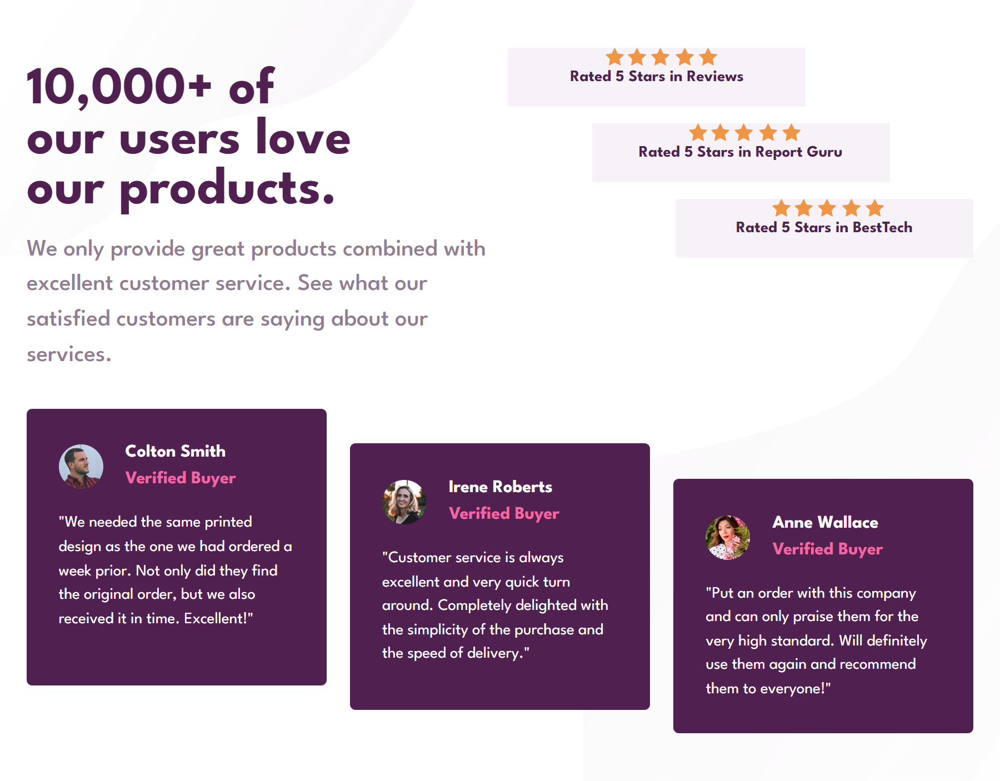
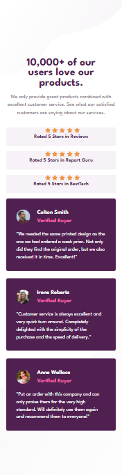

# Frontend Mentor - Social proof section solution

This is a solution to the [Social proof section challenge on Frontend Mentor](https://www.frontendmentor.io/challenges/social-proof-section-6e0qTv_bA). Frontend Mentor challenges help you improve your coding skills by building realistic projects.

## Overview

### The challenge

Users should be able to:

- View the optimal layout for the section depending on their device's screen size

### Screenshots

> Desktop screenshot

> Tablet screenshot

> Mobile screenshot

### Links

- Solution URL: [Frontend Mentor](https://www.frontendmentor.io/solutions/social-proof-section-qEgNYdxQ5-)
- Live Site URL: [GitHub Pages](https://bilel-mwihbi.github.io/Social-proof-section/)

## Author

- Frontend Mentor: [@Bilel-mwihbi](https://www.frontendmentor.io/profile/Bilel-mwihbi)
